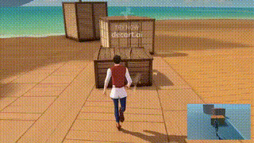
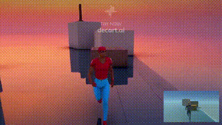
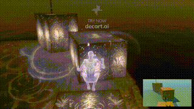
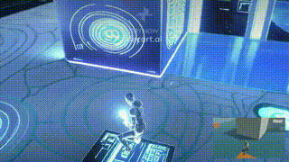

# Oasis-Mirage: Real-time White-box to Gameplay Transformation with MirageLSD AI

## Overview
**Oasis-Mirage** is an innovative project that leverages the power of **MirageLSD** AI to convert white-box (placeholder geometry) scenes into immersive, real-time video game environments. This is the first-ever system that allows you to experience a game world that evolves from simple geometric shapes into a full, playable environment in real-time.

Try it now and see the magic happen in front of your eyes. 🎮

[Check out MirageLSD on Decart.AI](https://mirage.decart.ai/)

## How it Works

- **White-box to Video**: We turn your basic geometric assets into stunning video game landscapes, and the best part is, it happens in real time.
- **Real-time Experience**: It's not just a video—it's a real playable world that transforms as you move and interact with it.
- **Customizable Prompts**: You can define the look and feel of the world by customizing prompts to adjust the visuals, making each playthrough unique.

## Features

- **First-of-its-kind**: The first game to fully convert white-box geometry to playable, immersive worlds in real time.
- **Real-Time Interaction**: Unlike traditional games, this experience allows you to interact with the world as it evolves, not just watch a pre-rendered video.
- **Customizable Visuals**: You can directly modify prompts and parameters to control the in-game visuals, providing endless creative possibilities.
- **Powered by MirageLSD**: MirageLSD uses advanced machine learning models to enhance and generate detailed environments from simple inputs, offering an unprecedented level of detail and responsiveness in gaming.

## Demo Videos
### Check out these short clips to see how the transformation works in real-time!

## Advantages of MirageLSD Integration

1. **Dynamic World Building**: MirageLSD allows for a highly flexible and dynamic approach to world building, generating highly realistic and context-specific environments from minimal input.
2. **AI-Driven Realism**: The AI engine continuously learns and refines the world-building process, ensuring that each environment is not only visually appealing but also contextually coherent.
3. **Unlimited Creativity**: With the ability to tweak parameters and provide custom prompts, users can shape their worlds to fit any desired narrative or theme, creating a truly personalized experience.
4. **Efficient Production**: What would typically take months of manual work in traditional game development can now be completed in real-time with just a few clicks.

## Current Status
This project is still in an early demonstration phase. While it is fully playable, there are ongoing improvements and optimizations. Expect regular updates and enhancements as we continue to refine this exciting technology!

## Contribution

Feel free to open issues, fork the repo, and submit your contributions. If you have any ideas, features, or bugs you'd like to report, please don't hesitate to reach out.

Thank you for supporting the project! ⭐