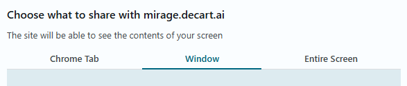
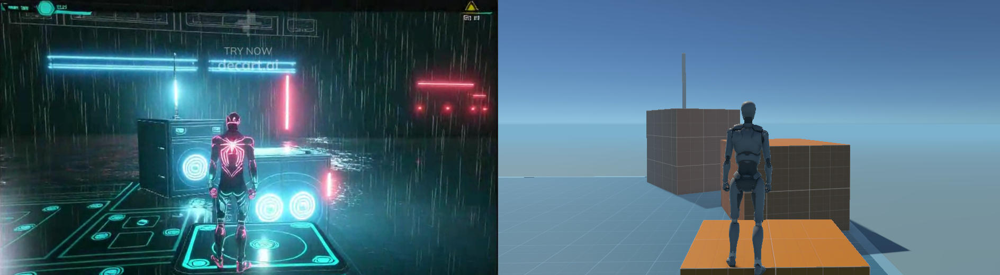
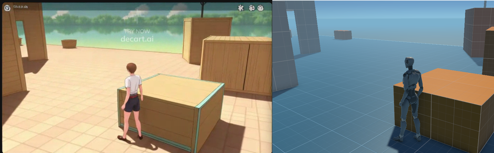
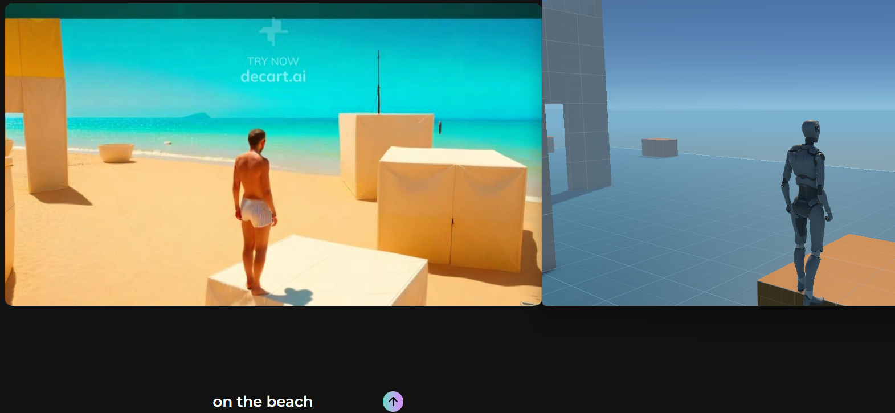

# How to Play?

At the moment, Decart doesn't offer a built-in API for integration, but the game is fully playable. 

In the future, if they release an API or if other similar open-source solutions become available, I’ll look into improving the integration.

## Install

Download Unity, clone this GitHub repository, and then run the game.

## Open Website

Visit [mirage](https://mirage.decart.ai/), then select **Window mode** under **Share Screen**. Find the game window and click **Share**.

Now, you can interact with the game in real-time and experience the content.

You can type in any scene you desire, and it will come to life.

For example, when I type "on the beach" below, a beach scene will appear.

